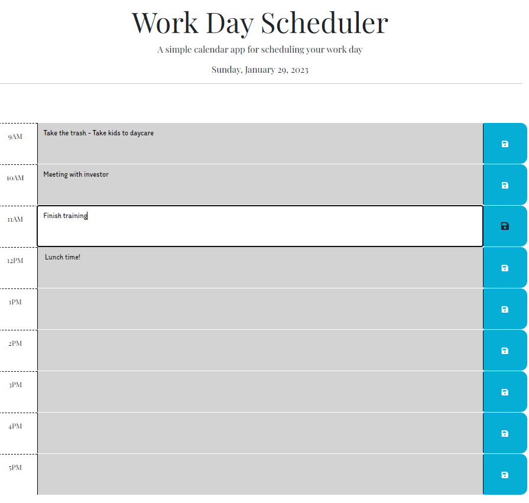

# Work Day Scheduler

## Description

This is a workday scheduler calendar that shows the current calendar day with the date at the top, and the standard business hours of 9 am to 5 pm. The user can enter an activity and save it. Then refresh the page and the activity will still be there.

I was motivated to practice what I have learned through the week about JQuery and Dayjs, and feel more comfortable programming in javascript.

## Usage

The calendar shows the office hours of 9 am to 5 pm. The user can click any of the rows, enter an activity, and save the changes clicking the save button on the right of the row.
The changes are saved to the localStorage, therefore, even if the user refreshes the page, the data is not going to disappear.

The calendar rows will show green if the event is in the future, red if the event is in the present, and gray if the event is in the past. 

Link to the deployed app https://ginitadavis.github.io/Word-Day-Scheduler/

## License
Copyright (c) [2022] [Gina Davis]

Permission is hereby granted, free of charge, to any person obtaining a copy of this software and associated documentation files (the "Software"), to deal in the Software without restriction, including without limitation the rights to use, copy, modify, merge, publish, distribute, sublicense, and/or sell copies of the Software, and to permit persons to whom the Software is furnished to do so, subject to the following conditions:

The above copyright notice and this permission notice shall be included in all copies or substantial portions of the Software.

THE SOFTWARE IS PROVIDED "AS IS", WITHOUT WARRANTY OF ANY KIND, EXPRESS OR IMPLIED, INCLUDING BUT NOT LIMITED TO THE WARRANTIES OF MERCHANTABILITY, FITNESS FOR A PARTICULAR PURPOSE AND NONINFRINGEMENT. IN NO EVENT SHALL THE AUTHORS OR COPYRIGHT HOLDERS BE LIABLE FOR ANY CLAIM, DAMAGES OR OTHER LIABILITY, WHETHER IN AN ACTION OF CONTRACT, TORT OR OTHERWISE, ARISING FROM, OUT OF OR IN CONNECTION WITH THE SOFTWARE OR THE USE OR OTHER DEALINGS IN THE SOFTWARE.